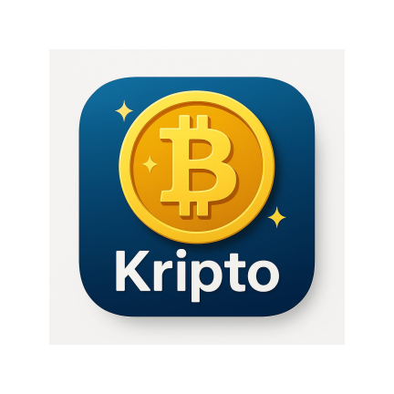
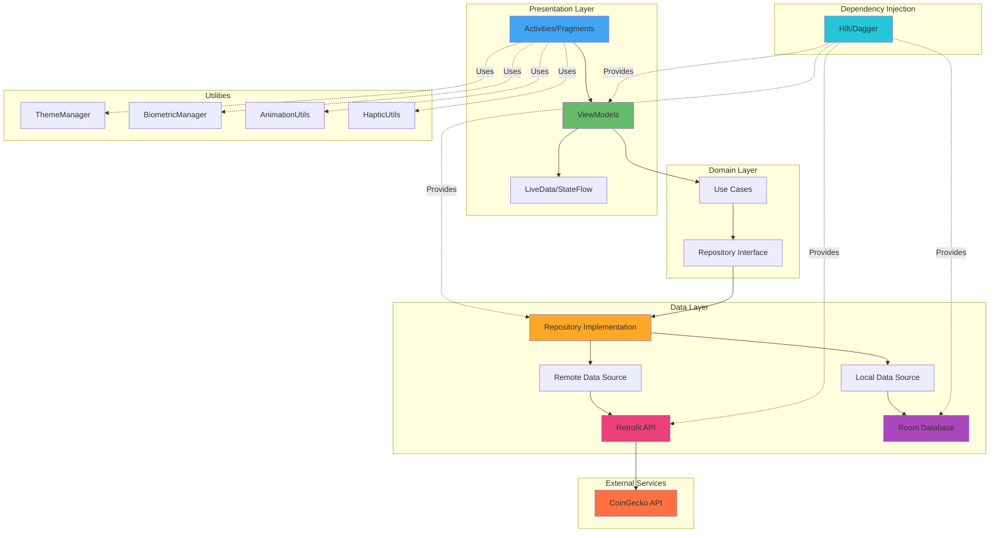

<div align="center">
  

  # Kripto

  ### A Modern Cryptocurrency Tracking App for Android

  [](https://www.android.com/)
  [](https://kotlinlang.org/)
  [](https://android-arsenal.com/api?level=24)
  [](https://www.gnu.org/licenses/gpl-3.0)

  [Demonstration](#-demonstration) • [Features](#-features) • [Architecture](#-architecture) • [Setup](#-development-setup) • [Contributing](#-contribution) • [License](#-license)

</div>

---

## ⚠️ Notice

**This app is currently under active development. You may encounter bugs or incomplete features. Please report any issues via our [GitHub Issues](https://github.com/adit9852/Kripto/issues) page.**

---

## 🎬 Demonstration

<p align="center">
  <a href="https://appetize.io/app/b_bwfv35l2yu4chbojkd7a5pti3y">
    🚀 <b>Launch Live Demo</b>
  </a>
</p>

## 📱 About

**Kripto** is a modern, feature-rich cryptocurrency tracking application for Android that provides real-time market data for over 7,000 cryptocurrencies. Built with the latest Android development practices and powered by [CoinGecko's API](https://www.coingecko.com/api/), Kripto offers a seamless user experience with dark mode, biometric security, and smooth animations.

<div align="center">
  <a href="https://www.coingecko.com/en">
    
  </a>
  <p><i>Powered by CoinGecko API</i></p>
</div>

---

## ✨ Features

### Core Features
- 📊 **Real-Time Market Data** - Track prices, market cap, volume, and price charts for 7000+ cryptocurrencies
- 🏦 **Exchange Tracking** - Monitor 400+ exchanges with Trust Score ratings
- ⭐ **Favorites** - Bookmark your preferred coins for quick access
- 🌍 **Global Market Stats** - View comprehensive cryptocurrency and DeFi market statistics
- 💱 **Multi-Currency Support** - Choose from multiple fiat currencies
- 📈 **Interactive Charts** - Beautiful price charts with multiple timeframes

### Modern UI/UX Features
- 🌙 **Dark Mode** - Full dark theme support with system-following option
- 🔐 **Biometric Authentication** - Secure your app with fingerprint/face unlock
- ✨ **Smooth Animations** - Material Design animations and transitions
- 📳 **Haptic Feedback** - Tactile response for better user interaction
- 🎨 **Multiple Themes** - Choose from various color themes
- ⚡ **Skeleton Loading** - Shimmer effect while loading data
- 🚀 **Modern Splash Screen** - Updated splash screen using Android 12+ API

---

## 🏗️ Architecture

Kripto follows modern Android development best practices with clean architecture and MVVM pattern.



### Architecture Components

- **MVVM Pattern** - Separation of concerns with ViewModel and LiveData
- **Repository Pattern** - Single source of truth for data operations
- **Dependency Injection** - Hilt for managing dependencies
- **Reactive Programming** - Kotlin Coroutines and Flow for asynchronous operations
- **Single Activity** - Navigation Component for fragment management

---

## 🛠️ Tech Stack

### Core Technologies
- **Language**: Kotlin 1.9.25
- **Min SDK**: 24 (Android 7.0)
- **Target SDK**: 35 (Android 15)
- **Build System**: Gradle 8.10.2 with AGP 8.7.2

### Libraries and Dependencies

#### Networking
- **[Retrofit 2.11.0](https://square.github.io/retrofit/)** - Type-safe HTTP client
- **[OkHttp 4.12.0](https://square.github.io/okhttp/)** - HTTP client with interceptors
- **[Gson 2.11.0](https://github.com/google/gson)** - JSON parsing

#### UI & Design
- **[Material Components 1.12.0](https://material.io/components)** - Material Design components
- **[Glide 4.16.0](https://github.com/bumptech/glide)** - Image loading and caching
- **[MPAndroidChart 3.1.0](https://github.com/PhilJay/MPAndroidChart)** - Interactive charts
- **[Lottie 6.1.0](https://airbnb.design/lottie/)** - Animation library
- **[Shimmer 0.5.0](https://github.com/facebook/shimmer-android)** - Skeleton loading effect
- **[Heroicons](https://heroicons.com/)** - Beautiful hand-crafted SVG icons

#### Architecture & DI
- **[Hilt 2.52](https://dagger.dev/hilt/)** - Dependency injection
- **[Navigation 2.8.5](https://developer.android.com/guide/navigation)** - Fragment navigation
- **[Lifecycle 2.8.7](https://developer.android.com/topic/libraries/architecture/lifecycle)** - Lifecycle-aware components
- **[Room 2.6.1](https://developer.android.com/training/data-storage/room)** - Local database

#### Async & Concurrency
- **[Coroutines 1.7.3](https://kotlinlang.org/docs/coroutines-overview.html)** - Asynchronous programming
- **[Flow](https://kotlinlang.org/docs/flow.html)** - Reactive streams

#### Other
- **[Timber 5.0.1](https://github.com/JakeWharton/timber)** - Logging
- **[Paging 3](https://developer.android.com/topic/libraries/architecture/paging/v3-overview)** - Paginated data loading
- **[WorkManager 2.10.0](https://developer.android.com/topic/libraries/architecture/workmanager)** - Background tasks
- **[Biometric 1.1.0](https://developer.android.com/jetpack/androidx/releases/biometric)** - Biometric authentication
- **[Core Splashscreen 1.0.1](https://developer.android.com/develop/ui/views/launch/splash-screen)** - Modern splash screens

---

## 📋 Prerequisites

Before you begin, ensure you have the following installed:

- **Android Studio** - Latest stable version (Hedgehog | 2023.1.1 or newer)
- **JDK** - Java Development Kit 17
- **Gradle** - Will be downloaded automatically by the wrapper
- **Android SDK** - API Level 35

[Download Android Studio](https://developer.android.com/studio)

---

## 🚀 Development Setup

### Method 1: Clone from Git

1. Open Android Studio
2. Select **"Get from VCS"** on the welcome screen
3. Enter the repository URL:
   ```
   https://github.com/YOUR_USERNAME/Kripto.git
   ```
4. Click **Clone**
5. Wait for Gradle sync to complete
6. Click **Run** ▶️ to build and install the app

### Method 2: Download ZIP

1. Download the project as ZIP from GitHub
2. Extract the ZIP file
3. Open Android Studio
4. Select **"Open"** and navigate to the extracted folder
5. Wait for Gradle sync to complete
6. Click **Run** ▶️ to build and install the app

### Building APK

To build an APK file:

1. Go to **Build → Build Bundle(s) / APK(s) → Build APK(s)**
2. Wait for the build to complete
3. Click **"locate"** in the notification to find your APK
4. APK location: `app/build/outputs/apk/debug/app-debug.apk`

**Or via command line:**

```bash
# Windows
.\gradlew.bat assembleDebug

# Linux/Mac
./gradlew assembleDebug
```

---

## 🔧 Configuration

### Gradle Configuration

The project uses:
- **Gradle**: 8.10.2
- **Android Gradle Plugin**: 8.7.2
- **Kotlin**: 1.9.25
- **Java**: 17

### API Configuration

The app uses CoinGecko's free API which doesn't require an API key. However, rate limits apply:
- **Free tier**: 10-30 calls/minute
- For higher limits, consider [CoinGecko API Pro](https://www.coingecko.com/en/api/pricing)

---

## 📱 Permissions Required

The app requires the following permissions:

```xml
<uses-permission android:name="android.permission.INTERNET" />
<uses-permission android:name="android.permission.ACCESS_NETWORK_STATE" />
<uses-permission android:name="android.permission.VIBRATE" />
<uses-permission android:name="android.permission.USE_BIOMETRIC" />
```

- **INTERNET** - Required to fetch cryptocurrency data from API
- **ACCESS_NETWORK_STATE** - Check network connectivity status
- **VIBRATE** - Haptic feedback for user interactions
- **USE_BIOMETRIC** - Optional biometric authentication

---

## 🎨 Features Showcase

### Dark Mode
Full dark theme support with three options:
- Light Mode
- Dark Mode
- Follow System (Android 10+)

### Biometric Security
Optional fingerprint or face unlock to secure the app.

### Smooth Animations
- Fade-in animations for list items
- Pulse effects on button clicks
- Shake animations for errors
- Material Design transitions

### Multi-Theme Support
Choose from various color themes:
- Red
- Blue
- Green
- Blue Gray
- And more...

---

## 🤝 Contribution

Contributions are welcome! Here's how you can help:

1. **Fork** the repository
2. **Create** a feature branch (`git checkout -b feature/AmazingFeature`)
3. **Commit** your changes (`git commit -m 'Add some AmazingFeature'`)
4. **Push** to the branch (`git push origin feature/AmazingFeature`)
5. **Open** a Pull Request

Please read our [Contributing Guidelines](.github/CONTRIBUTING.md) for more details.

### Areas for Contribution
- 🐛 Bug fixes
- ✨ New features
- 📝 Documentation improvements
- 🎨 UI/UX enhancements
- 🌐 Translations
- ♿ Accessibility improvements

---

## 📝 Project Structure

```
Kripto/
├── app/
│   ├── src/
│   │   ├── main/
│   │   │   ├── java/com/camo/kripto/
│   │   │   │   ├── error/          # Error handling
│   │   │   │   ├── local/          # Room database
│   │   │   │   ├── remote/         # API services
│   │   │   │   ├── repos/          # Repository pattern
│   │   │   │   ├── ui/             # Activities, Fragments, Adapters
│   │   │   │   │   ├── adapter/
│   │   │   │   │   ├── presentation/
│   │   │   │   │   └── viewModel/
│   │   │   │   ├── utils/          # Utility classes
│   │   │   │   └── workers/        # Background workers
│   │   │   ├── res/                # Resources
│   │   │   │   ├── layout/
│   │   │   │   ├── values/
│   │   │   │   ├── values-night/   # Dark theme colors
│   │   │   │   ├── drawable/
│   │   │   │   └── mipmap/
│   │   │   └── AndroidManifest.xml
│   │   ├── test/                   # Unit tests
│   │   └── androidTest/            # Instrumentation tests
│   └── build.gradle
├── gradle/
├── build.gradle
└── settings.gradle
```

---

## 🐛 Known Issues

- Rate limiting may occur with rapid API calls (CoinGecko free tier limitation)
- Some cryptocurrency logos may not load due to API response

---

## 🔮 Future Enhancements

- [ ] Price alerts and notifications
- [ ] Portfolio tracking
- [ ] News integration
- [ ] Widget support
- [ ] Export data to CSV
- [ ] Compare cryptocurrencies
- [ ] Watchlist sync across devices
- [ ] Support for more fiat currencies

---

## 📄 License

```
Kripto - A Cryptocurrency Tracking App
Copyright (C) 2024

This program is free software: you can redistribute it and/or modify
it under the terms of the GNU General Public License as published by
the Free Software Foundation, either version 3 of the License, or
(at your option) any later version.

This program is distributed in the hope that it will be useful,
but WITHOUT ANY WARRANTY; without even the implied warranty of
MERCHANTABILITY or FITNESS FOR A PARTICULAR PURPOSE.  See the
GNU General Public License for more details.

You should have received a copy of the GNU General Public License
along with this program.  If not, see <https://www.gnu.org/licenses/>.
```

[](https://www.gnu.org/licenses/gpl-3.0.en.html)

---

## 👨‍💻 Author

Created with ❤️ by the Kripto team

---

## 🙏 Acknowledgments

- [CoinGecko](https://www.coingecko.com/) for providing the comprehensive cryptocurrency API
- [Heroicons](https://heroicons.com/) for beautiful icons
- All open-source contributors whose libraries made this project possible

---

## 📞 Support

If you encounter any issues or have questions:

- 🐛 [Report a Bug](https://github.com/YOUR_USERNAME/Kripto/issues/new?labels=bug)
- 💡 [Request a Feature](https://github.com/YOUR_USERNAME/Kripto/issues/new?labels=enhancement)
- 📧 Contact: your.email@example.com

---

<div align="center">

  **If you find this project useful, please consider giving it a ⭐️!**

  Made with ❤️ using Kotlin and Android

</div>
